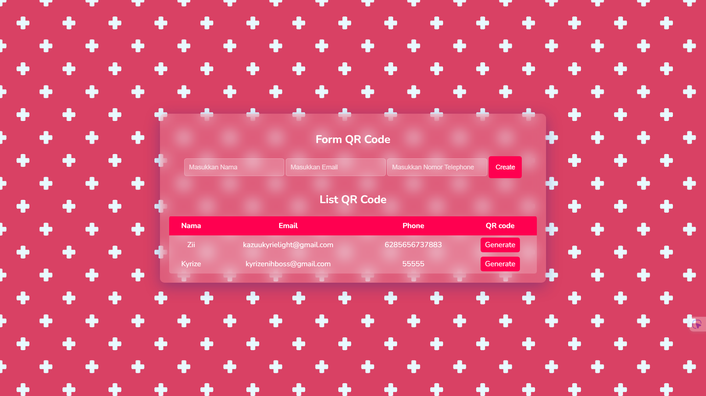

# QR Code Generator

🚀 **QR Code Generator** adalah proyek sederhana berbasis Laravel untuk membuat QR Code dengan mudah menggunakan library [simplesoftwareio/simple-qrcode](https://github.com/SimpleSoftwareIO/simple-qrcode).

Laravel adalah **framework PHP** yang populer dan digunakan untuk membangun aplikasi web dengan sintaks yang elegan dan efisien. Laravel menyediakan berbagai fitur seperti **routing, middleware, ORM (Eloquent), autentikasi, dan migrasi database** untuk mempermudah pengembangan aplikasi.

Salah satu kekuatan Laravel adalah dukungan terhadap berbagai **library eksternal** melalui Composer. Dalam proyek ini, kita menggunakan library **[simplesoftwareio/simple-qrcode](https://github.com/SimpleSoftwareIO/simple-qrcode)**, yang merupakan wrapper untuk **QRCode Generator** berbasis PHP. Library ini memungkinkan kita untuk membuat QR Code dengan berbagai kustomisasi seperti ukuran, warna, dan format dengan mudah. 🚀

## ✨ Fitur

-   🔹 Generate QR Code dengan teks atau URL custom
-   🎨 Bisa dikustomisasi (warna, ukuran, dan format)
-   📥 Download QR Code sebagai gambar
-   ⚡ Cepat dan mudah digunakan

## 📌 Instalasi

Pastikan kamu sudah menginstal **Composer** dan **Laravel** di sistemmu.

1️⃣ **Clone repository ini**

```bash
git clone https://github.com/username/qr-code-generator.git
cd qr-code-generator
```

2️⃣ **Install dependensi**

```bash
composer install
```

3️⃣ **Salin file konfigurasi**

```bash
cp .env.example .env
```

4️⃣ **Generate application key**

```bash
php artisan key:generate
```

5️⃣ **Install library QR Code**

```bash
composer require simplesoftwareio/simple-qrcode
```

6️⃣ **Jalankan server lokal**

```bash
php artisan serve
```

Sekarang akses **http://127.0.0.1:8000** di browser! 🚀

## 🛠 Cara Penggunaan

Di dalam controller, kamu bisa membuat QR Code seperti ini:

```php
use SimpleSoftwareIO\QrCode\Facades\QrCode;

public function generateQR() {
    return QrCode::size(300)->generate('https://yourwebsite.com');
}
```

Atau langsung di Blade template:

```blade
{!! QrCode::size(300)->generate('https://yourwebsite.com') !!}
```

## 🖼️ Preview




## 📜 Lisensi

Proyek ini menggunakan lisensi **MIT** – bebas digunakan dan dimodifikasi. 🚀

---

💡 **Kontribusi**: Jika ingin berkontribusi, silakan buat pull request atau buka issue! 😊
